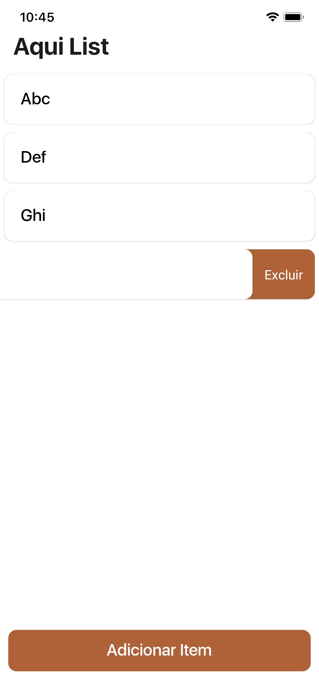

# Aqui List (S)
 Aqui's lightweight, simple base version for Aqui List. "S" stands for "small".
 # Built with:
- JavaScript;
- React Native (+ Expo).

 # It gives:
- Single list of items;
- Item deleting, editing;
- Unlimited item creation

 # More about Aqui List S:
 This is a testing version of the normal-sized Aqui List, coming out for Android devices later this year.

 # Language support:
This project was made in Portuguese (Brazil). We have plans to add language support in the near future.
